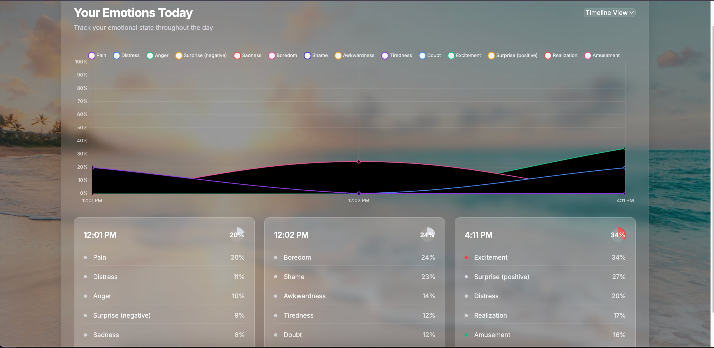

# Ruby - Your Emotion Mentor

Uncover authentic feelings that go beyond your spoken words. Ruby analyzes your emotional tone, speech pattern, and rhythm to help you become aware of emotions you may be feeling but not even realize that you are. 

Real-time emotion analysis through audio recordings from the Omi wearable device. It uses the Hume AI SDK for emotional expression measurement in voice data. 

## Features

- Real-time audio reception every 5-seconds from the Omi wearable device
- Emotion analysis using Hume AI's prosody model
- Web interface for viewing emotion analysis results
  
## Installation

1. Clone the repository
2. Install required Python packages
3. Install SoX (for audio processing)
4. Create a `.env` file in the project root and add your Hume AI API key
5. Install ngrok (for public deployment)

## Deployment

1. Start the Flask server. http://localhost:8000/emotions/view
2. In a new terminal, create a public URL with ngrok
3. ngrok will provide a public URL
4. Use this URL as your endpoint in the Omi wearable configuration

## Omi Wearable Integration

1. Configure your Omi wearable to send audio data to your server:
2. The Omi device will send 5-second audio clips to your server
3. 5 randomly chosen clips in every 20-min interval will be processed for emotion analysis using Hume AI's Expression Measurement API
4. View the results in real-time at the `/emotions/view` endpoint
